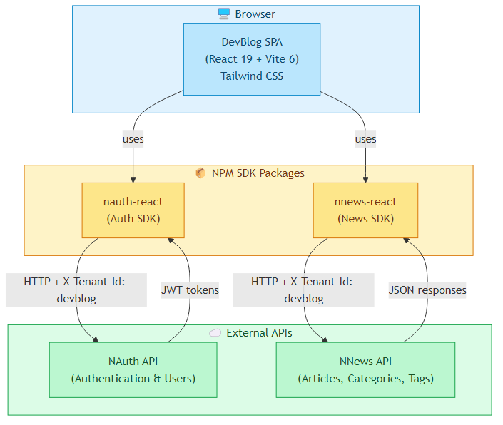

# DevBlog - Blog para Desenvolvedores


## Overview

**DevBlog** is a developer blog platform built as a React Single Page Application. It provides article publishing with rich editing, category and tag management, user authentication, and a dashboard for content management. The UI is in Brazilian Portuguese (pt-BR). Built using **React 19**, **TypeScript**, **Vite 6**, and **Tailwind CSS**.

The frontend relies on two external API services through their respective SDK packages:
- **nauth-react** — handles authentication, user registration, profile, and password management
- **nnews-react** — handles articles, categories, and tags CRUD operations

Both APIs use multi-tenant isolation via the `X-Tenant-Id: devblog` header.

---

## 🚀 Features

- 📝 **Article Management** - Create, edit, and publish articles with rich editor (via nnews-react `ArticleEditor` component)
- 📂 **Categories** - Organize articles by categories with full CRUD
- 🏷️ **Tags** - Tag-based article classification with full CRUD
- 🔐 **Authentication** - Login, registration, password reset via NAuth API
- 👤 **User Profile** - Profile management and password change
- 📊 **Dashboard** - Content stats overview with quick actions
- 🌙 **Dark Mode** - System-based dark mode support via Tailwind `class` strategy
- 🔔 **Toast Notifications** - User feedback via sonner

---

## 🛠️ Technologies Used

### Core Framework
- **React 19** — UI library with React Router 7 for routing
- **TypeScript 5.6** — Strict mode with `noUnusedLocals` and `noUnusedParameters`
- **Vite 6** — Dev server and build tooling

### Styling
- **Tailwind CSS 3.4** — Utility-first CSS with `darkMode: ['class']`
- **@tailwindcss/typography** — Prose styling for article content
- **tailwindcss-animate** — Animation utilities

### External SDKs
- **nauth-react** — Authentication provider, hooks (`useAuth`), and UI components
- **nnews-react** — News provider, hooks (`useArticles`, `useCategories`, `useTags`), and `ArticleEditor` component

### Additional Libraries
- **lucide-react** — Icon library
- **sonner** — Toast notification system
- **react-router-dom** — Client-side routing with protected routes

---

## 📁 Project Structure

```
personal-blog/
├── public/                  # Static assets
├── src/
│   ├── components/          # Shared components (Layout, Navbar, ProtectedRoute)
│   ├── lib/                 # Constants and utilities
│   │   └── constants.ts     # Route paths and app name
│   ├── pages/               # Page components (one per route)
│   ├── App.tsx              # Root component with providers and routing
│   ├── main.tsx             # Entry point
│   └── index.css            # Global styles and Tailwind imports
├── docs/                    # Documentation and diagrams
├── index.html               # HTML entry point (lang="pt-BR")
├── tailwind.config.js       # Tailwind config (includes nauth-react/nnews-react content paths)
├── tsconfig.json            # TypeScript config (strict mode)
├── vite.config.ts           # Vite config (port 5173)
└── package.json             # Dependencies and scripts
```

---

## 🏗️ System Design

The following diagram illustrates the high-level architecture of **DevBlog**:



The DevBlog SPA runs entirely in the browser. It uses two NPM SDK packages (`nauth-react` and `nnews-react`) that communicate with their respective backend APIs over HTTP. Both APIs are multi-tenant, identified by the `X-Tenant-Id: devblog` header. The NAuth API handles authentication and returns JWT tokens, while the NNews API manages all content (articles, categories, tags).

> 📄 **Source:** The editable Mermaid source is available at [`docs/system-design.mmd`](docs/system-design.mmd).

---

## ⚙️ Environment Configuration

Before running the application, configure the environment variables:

### 1. Create the `.env` file

```bash
cp .env.example .env
```

### 2. Edit the `.env` file

```bash
# NAuth API base URL
VITE_AUTH_API_URL=https://your-auth-api-url.com

# NNews API base URL
VITE_NEWS_API_URL=https://your-news-api-url.com
```

⚠️ **IMPORTANT**:
- Never commit the `.env` file with real credentials
- Only the `.env.example` should be version controlled

---

## 🔧 Manual Setup

### Prerequisites
- **Node.js** 18+
- **npm** 9+

### Setup Steps

#### 1. Install dependencies

```bash
npm install
```

#### 2. Configure environment variables

```bash
cp .env.example .env
# Edit .env with your API URLs
```

#### 3. Start development server

```bash
npm run dev
```

The application will be available at **http://localhost:5173**.

---

## 🚀 Deployment

### Development

```bash
npm run dev
```

### Production Build

```bash
npm run build
```

Build output goes to the `dist/` directory. Serve it with any static file server.

### Type Check Only

```bash
npm run type-check
```

### Preview Production Build

```bash
npm run preview
```

---

## 👨‍💻 Author

Developed by **[Rodrigo Landim Carneiro](https://github.com/landim32)**

---

## 📄 License

This project is licensed under the **MIT License** - see the [LICENSE](LICENSE) file for details.

---

## 🙏 Acknowledgments

- Built with [React](https://react.dev)
- Styled with [Tailwind CSS](https://tailwindcss.com)
- Powered by [Vite](https://vite.dev)
- Icons by [Lucide](https://lucide.dev)

---

## 📞 Support

- **Issues**: [GitHub Issues](https://github.com/emaginebr/personal-blog/issues)

---

**⭐ If you find this project useful, please consider giving it a star!**
